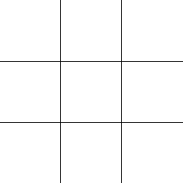
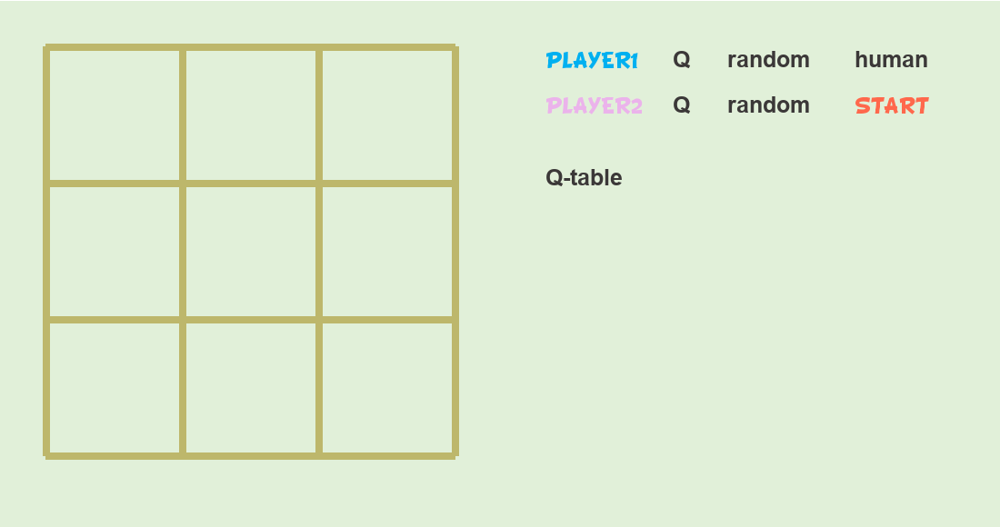

# TicTacToe_Q_table
Playing TicTacToe by **tabular Q-Learning**.

Require: <code>pip install pygame</code>

## Build Gym-like enviroment and test
Build enviroment: [here](https://github.com/wwsyan/TicTacToe_Q_table/blob/main/tictactoe_qtable/TicTacToe_env.py).
Test enviroment: [here](https://github.com/wwsyan/TicTacToe_Q_table/blob/main/tictactoe_qtable/TicTacToe_env_test.py).

| Random step test |
| :---: |
||

## Tabular Q-Learning traning process
See code [here](https://github.com/wwsyan/TicTacToe_Q_table/blob/main/tictactoe_qtable/Table%20QLearning%20play%20TicTacToe.py).

## Game UI
Play TicTacToe based on a well-trained <code>Q_table_dict</code>.
See code [here](https://github.com/wwsyan/TicTacToe_Q_table/blob/main/tictactoe_qtable/TicTacToe%20Game.py).

| Performance | Mode |
| :---: | :---: |
|  | Agent vs Agent |
|  | Human vs Agent |

